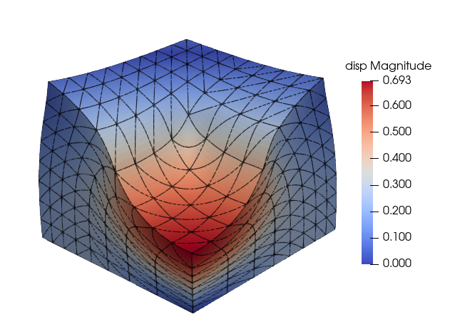

Example 4 - Block under compression in 3D with nearly incompressible Neo-Hookean material
=========================================================================================

In this example, we simulate the example of 3D block with nearly incompressible Neo-Hookean material under compressible load.

The configuration file is shown below.
::

    Files
    {
      mesh : block3d-P2-nelem8
    }

    Model Type
    {
      dimension     : 3
    }

    Domains
    {
      block
      {
        Material   : 1
        Element    : 1
      }
    }

    Material
    {
      id               : 1
      name             : Matl_NeoHookean
      density          : 1.0
      data_deviatoric :  80.19367957863858
      data_volumetric :  3  2.494128406043830e-06
    }

    Element
    {
      id            : 1
      type         : ELEM_SOLID_3D_MIXED1

    }

    Boundary Conditions
    {
        symX
        {
            type          : specified
            dof           : UX
            value         : 0
        }

        symY
        {
            type          : specified
            dof           : UY
            value         : 0
        }

        symZ
        {
            type          : specified
            dof           : UZ
            value         : 0
        }

        top
        {
            type          : specified
            dof           : UX
            value         : 0
        }

        top
        {
            type          : specified
            dof           : UY
            value         : 0
        }

        pressure
        {
            type          : specified
            dof           : UX
            value         : 0
        }

        pressure
        {
            type          : specified
            dof           : UY
            value         : 0
        }

    }

    Tractions
    {
        pressure
        {
            type          : traction
            value         : -320  0.0  0.0
            timefunction  : 1
        }
    }

    Time Functions
    {

    ! lam(t) = p1 + p2*t + p3*sin(p4*t+p5) + p6*cos(p7*t+p8)
    !
    ! id   t0      t1     p1   p2     p3    p4    p5    p6    p7    p8
       1   0.0   1000.0  0.0  1.0    0.0   0.0   0.0   0.0   0.0   0.0

    }

    Solver
    {

    solvertype       :  newton

    timescheme       :  STEADY

    spectralRadius   :  0.0

    finalTime        :  1.0

    timeStep         :  0.2

    maximumSteps     :  10

    maximumIterations  :  20

    tolerance        :  1.0e-7

    debug            :  0

    }

`ELEM_SOLID_3D_MIXED1` is the Taylor-Hood element. For the P2 element, quadratic element is used for the displacement field and the linear continuous element for the pressure field.

The contour plot of displacement magnitude, along with the element edges, is shown in the figure below.

